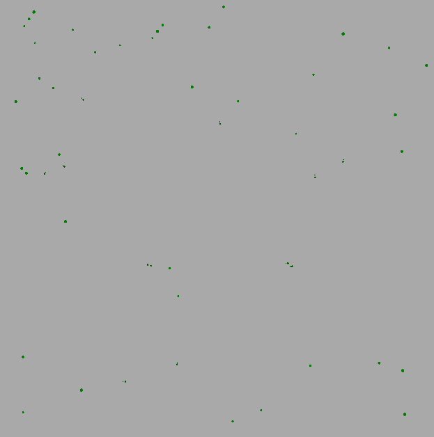
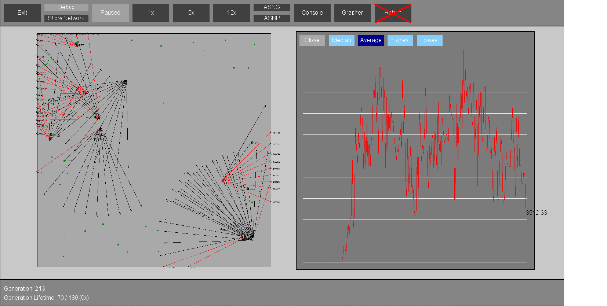

# evolvi

This is an old high school project done during my last year, where I studied the strengths and weaknesses for using genetic algorithms as a training method for neural networks.. It's a simulation of a very simple species that only has vision, with the objective to create a species that hunts for food, while maintaining a relatively stable speed to not waste energy. 

The structure of the project is not very good, but it was one of my first big projects ever, and really did provide me with great insight as to what goes into a rather big project.

Below is a gif of a simulation at about generation 50.

And here we have the GUI for the simulation.

